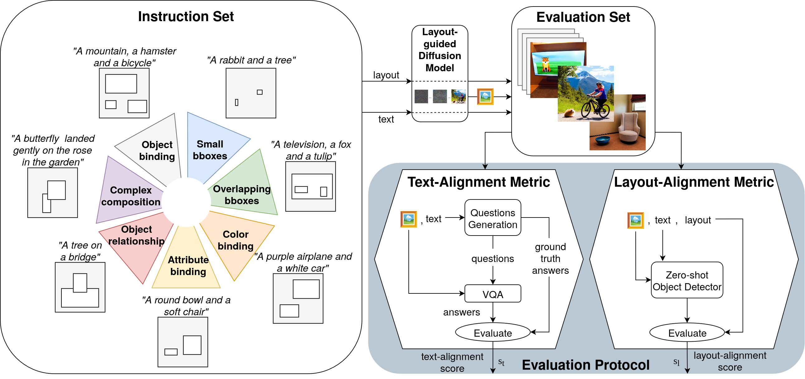

# 7Bench: a Comprehensive Benchmark for Layout-guided Text-to-image Models

[Elena Izzo](https://www.linkedin.com/in/elena-izzo-b87b69164)\*, [Luca Parolari](https://github.com/lparolari)\*, [Davide Vezzaro](https://www.linkedin.com/in/davidevezzaro/)\*, [Lamberto Ballan](http://www.lambertoballan.net/) \
Department of Mathematics, University of Padova, Padova, Italy

🌟 Accepted to 23rd International Conference on Image Analysis and Processing (ICIAP) 2025, 15-19 September 2025, Rome, Italy

\*These authors contributed equally to this work and are listed in alphabetical order.



## Abstract

Layout-guided text-to-image models offer greater control over the generation process by explicitly conditioning image synthesis on the spatial arrangement of elements.
As a result, their adoption has increased in many computer vision applications, ranging from content creation to synthetic data generation.
A critical challenge is achieving precise alignment between the image, textual prompt, and layout, ensuring semantic fidelity and spatial accuracy. 
Although recent benchmarks assess text alignment, layout alignment remains overlooked, and no existing benchmark jointly evaluates both. 
This gap limits the ability to evaluate a model's spatial fidelity, which is crucial when using layout-guided generation for synthetic data, as errors can introduce noise and degrade data quality.
In this work, we introduce 7Bench, the first benchmark to assess both semantic and spatial alignment in layout-guided text-to-image generation.
It features text-and-layout pairs spanning seven challenging scenarios, investigating object generation, color fidelity, attribute recognition, inter-object relationships, and spatial control.
We propose an evaluation protocol that builds on existing frameworks by incorporating the layout alignment score to assess spatial accuracy.
Using 7Bench, we evaluate several state-of-the-art diffusion models, uncovering their respective strengths and limitations across diverse alignment tasks. 
The benchmark is available at https://github.com/Elizzo/7Bench.

## Benchmark

| Benchmark | N. samples | N. scenarios | Layout |
| --- | --- | --- | --- |
| [7bench.csv](benchmark/7bench.csv) | 224 | 7 | ✔️ |

### Format

The benchmark is distributed as a CSV file with one row per sample, including following columns:

| Column | Optional | Description |
| --- | --- | --- |
| `id` | - | Unique identifier for each sample. |
| `category` | - | One of the seven 7Bench scenarios: object_binding, object_relationship, overlapping_bboxes, small_bboxes, color_binding, attribute_binding and complex_composition.  |
| `prompt` | - | Full natural-language prompt describing the scene.  |
| **layout** |
| `obj1` | - | First object mentioned in the prompt (always present). |
| `bbox1` | - | Bounding box for `obj1`, formatted as `(x_min, y_min, x_max, y_max)`. Coordinates are in 512x512 space.  |
| `obj2` | yes | Second object referenced in the prompt.  |
| `bbox2` | yes | Bounding box for `obj2`. |
| `obj3` | yes | Third object referenced in the prompt.  |
| `bbox3` | yes | Bounding box for `obj3`. |
| `obj4` | yes | Fourth object, used in complex scenarios.  |
| `bbox4` | yes | Bounding box for `obj4`. |

# Reproducibility

We provide the code for the models we use to generate the images, the images we generated instructing this models with 7Bench prompts and the the code used to evaluate the generated images.

## Models Under Evaluation

| Model |
| --- |
| [Stable Diffusion 1.4](https://github.com/davidevezzaro/sd14-test) |
| [Cross Attention Guidance](https://github.com/davidevezzaro/layout-guidance-test) |
| [GLIGEN](https://github.com/davidevezzaro/gligen-test) |
| [BoxDiff](https://github.com/davidevezzaro/boxdiff-test) |
| [Attention Refocusing](https://github.com/davidevezzaro/attention-refocusing-test) |

## Generated Images

| Images |
| --- |
| [7bench-SD14](https://unipdit-my.sharepoint.com/:f:/g/personal/davide_vezzaro_4_studenti_unipd_it/Egdo_40JH1NCuhMuFSkIVYkBtCiodQSYs2t0J5vZjEbyxg?e=ZvYwFu) |
| [7bench-SD_CAG](https://unipdit-my.sharepoint.com/:f:/g/personal/davide_vezzaro_4_studenti_unipd_it/Egdo_40JH1NCuhMuFSkIVYkBtCiodQSYs2t0J5vZjEbyxg?e=9Yviax) |
| [7bench-G](https://unipdit-my.sharepoint.com/:f:/g/personal/davide_vezzaro_4_studenti_unipd_it/EmYmCRCH81hNkiMxJ7RTYCUBoNGH5_1xmLf4MxK3M7ExWQ?e=7O1E8H) |
| [7bench-G_BD](https://unipdit-my.sharepoint.com/:f:/g/personal/davide_vezzaro_4_studenti_unipd_it/EuunPEWMCh9Nq801mBeMYsAB_uy0zWmVcJzHNDV0Ruw54Q?e=fBVnth) |
| [7bench-G_AR](https://unipdit-my.sharepoint.com/:f:/g/personal/davide_vezzaro_4_studenti_unipd_it/EshO-zqwsVhFgHANisiLA1QBYPxmJC8rghvKNODrdaW_CQ?e=kiPBVC) |

## Evaluation Pipeline

The generated images can evaluated using our pipeline. The source code of the evaluation pipeline for layout-guided models adapated from TIFA can be found at: 
- [Evaluation Pipeline](https://github.com/davidevezzaro/tifa-test)

## Further Resources

Other resources (e.g. a small prompt collection for testing) can be found [here](https://github.com/davidevezzaro/thesis-resources).

# Citation

If you use 7Bench or any part of this repository in your research, please consider citing our work:

```
Proceedings coming soon...
```